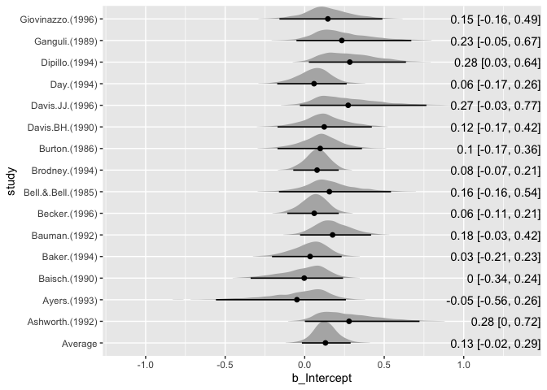
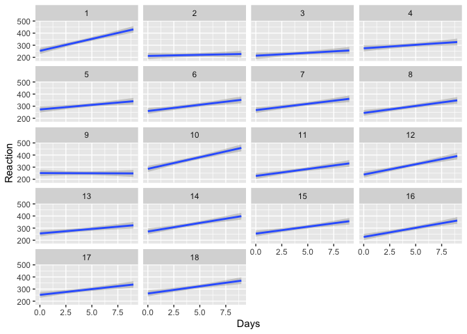
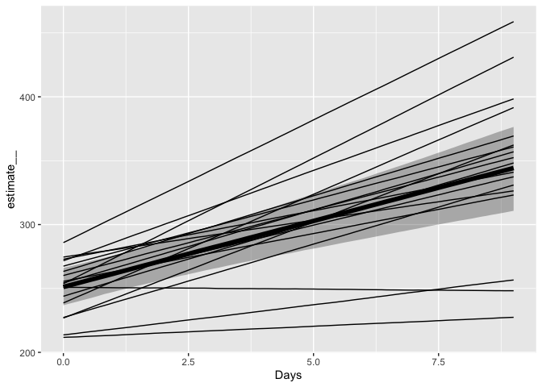

<!-- README.md is generated from README.Rmd. Please edit that file -->

# brmstools

brmstools was an R package that provided one-liners for drawing figures
from regression models fitted with the [brms
package](https://github.com/paul-buerkner/brms).

**The package is no longer maintained**: Its functionality can be
replicated by using native functions from the brms package and functions
from the [tidybayes package](https://github.com/mjskay/tidybayes).
Example code for reproducing brmstools’ figures is shown below.

# Required packages

``` r
library(brms)
#> Loading required package: Rcpp
#> Registered S3 method overwritten by 'xts':
#>   method     from
#>   as.zoo.xts zoo
#> Loading 'brms' package (version 2.9.0). Useful instructions
#> can be found by typing help('brms'). A more detailed introduction
#> to the package is available through vignette('brms_overview').
library(tidyverse)
#> ── Attaching packages ──────────────────────────────────────────────────────────────── tidyverse 1.2.1 ──
#> ✔ ggplot2 3.2.0          ✔ purrr   0.3.2     
#> ✔ tibble  2.1.3          ✔ dplyr   0.8.3     
#> ✔ tidyr   0.8.3.9000     ✔ stringr 1.4.0     
#> ✔ readr   1.3.1          ✔ forcats 0.4.0
#> ── Conflicts ─────────────────────────────────────────────────────────────────── tidyverse_conflicts() ──
#> ✖ dplyr::filter() masks stats::filter()
#> ✖ dplyr::lag()    masks stats::lag()
library(tidybayes)  # https://github.com/mjskay/tidybayes
library(ggridges)  # https://github.com/clauswilke/ggridges
#> 
#> Attaching package: 'ggridges'
#> The following object is masked from 'package:ggplot2':
#> 
#>     scale_discrete_manual
```

# Forest plots

After fitting a meta-analytic model, creating a forest plot is easy with
tidybayes and ggridges.

First, fit a meta-analytic model with some example data from the
[metafor](https://github.com/wviechtb/metafor) package.

``` r
data("dat.bangertdrowns2004", package = "metafor")
dat <- dat.bangertdrowns2004 %>%
  mutate(study = paste0(author, " (", year, ")"), sei = sqrt(vi)) %>%
  select(study, yi, sei) %>%
  slice(1:15)
dat$study <- str_replace(dat$study, ",", "")  # Remove commas in study names
fit_rem <- brm(
  yi | se(sei) ~ 1 + (1|study),
  data = dat,
  cores = 4, 
  control=list(adapt_delta = .99),
  file = "fit-rem"
)
```

For an explanation of `tidybayes::spread_draws()`, refer to
<http://mjskay.github.io/tidybayes/articles/tidy-brms.html>.

``` r
# Study-specific effects are deviations + average
out_r <- spread_draws(fit_rem, r_study[study,term], b_Intercept) %>% 
  mutate(b_Intercept = r_study + b_Intercept) 
# Average effect
out_f <- spread_draws(fit_rem, b_Intercept) %>% 
  mutate(study = "Average")
# Combine average and study-specific effects' data frames
out_all <- bind_rows(out_r, out_f) %>% 
  ungroup() %>%
  # Ensure that Average effect is on the bottom of the forest plot
  mutate(study = fct_relevel(study, "Average"))
# Data frame of summary numbers
out_all_sum <- group_by(out_all, study) %>% 
      mean_qi(b_Intercept)
#> Warning: unnest() has a new interface. See ?unnest for details.
#> Try `cols = c(.lower, .upper)`, with `mutate()` needed
# Draw plot
out_all %>%   
  ggplot(aes(b_Intercept, study)) +
  geom_density_ridges(
    rel_min_height = 0.01, 
    col = NA,
    scale = 1
  ) +
  geom_pointintervalh(
    data = out_all_sum, size = 1
  ) +
  geom_text(
    data = mutate_if(out_all_sum, is.numeric, round, 2),
    # Use glue package to combine strings
    aes(label = glue::glue("{b_Intercept} [{.lower}, {.upper}]"), x = Inf),
    hjust = "inward"
  )
#> Picking joint bandwidth of 0.0226
```



# Panel plots

First, fit a multilevel model to multiple subjects’ data

``` r
data(sleepstudy, package = "lme4")
fit_ml <- brm(
  Reaction ~ Days + (Days|Subject),
  data = sleepstudy,
  cores = 4,
  file = "fit-ml"
)
```

Draw a panel plot using `brms::marginal_effects()`

``` r
marginal_effects(
  fit_ml,
  "Days", 
  conditions = distinct(sleepstudy, Subject),
  re_formula = NULL
  )
```



# Spaghetti plots

Spaghetti plot combines `marginal_effects()` of the random and fixed
effects’ regression lines.

``` r
out_f <- marginal_effects(
  fit_ml,
  "Days"
  )[[1]]
out_r <- marginal_effects(
  fit_ml,
  "Days", 
  conditions = distinct(sleepstudy, Subject),
  re_formula = NULL
  )[[1]]
out_r %>% 
  ggplot(aes(Days, estimate__)) +
  geom_ribbon(
    data = out_f,
    aes(ymin = lower__, ymax = upper__),
    alpha = .33
  ) +
  geom_line(data = out_f, size = 2) +
  geom_line(aes(group = Subject))
```


